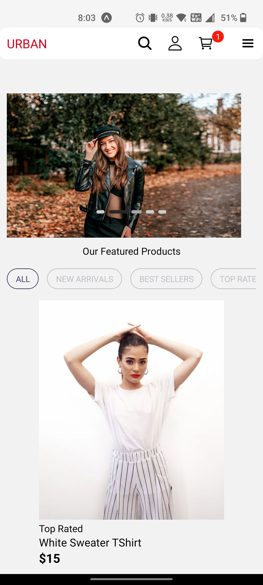
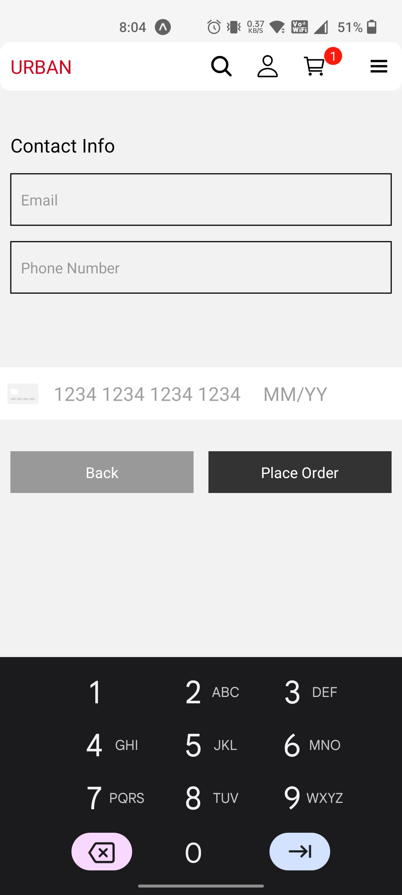
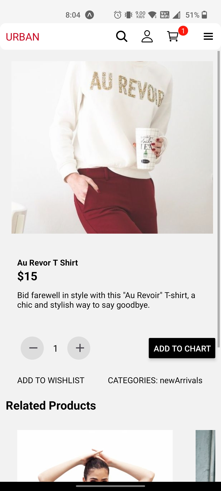
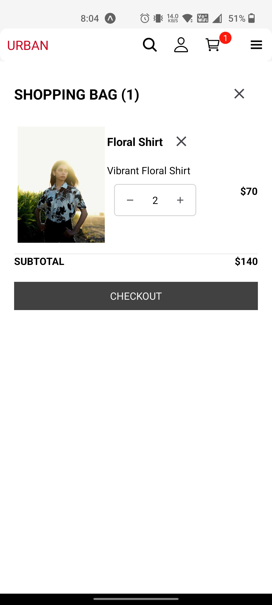

# Urban-App

## Description

Urban-App is a mobile e-commerce application developed using React Native. This app is based on the website Urban <https://urban-rust.vercel.app/>. The backend is powered by Strapi and it uses Stripe for the payment system. It allows users to browse products, add them to the cart, and make purchases.

## Installation

To get started with this project, do the following:

1. First clone the repo to your local machine using `git clone <https://github.com/ambesh333/Urban-App>`.
2. Navigate to the project directory and install the dependencies with `npx install-expo-modules@latest`.
3. Start the application with `npx expo start`.

## Features

- **Product Listing**: The app displays a list of available products for the user to browse.
- **Shopping Cart**: Users can add products to a shopping cart and view the cart at any time.
- **Checkout**: When ready, users can proceed to a checkout screen where they can finalize their purchase.
- **Backend**: The backend is powered by Strapi, a flexible, open-source Headless CMS.
- **Payment System**: The app uses Stripe for processing payments securely.

## Demo

Here are some screenshots and a demo video of the app:

| Demo Video | Home Page | Payment | Product Details | Cart |
| --- | --- | --- | --- | --- |
|   |  |  |  |  |

## Contributing

Pull requests are welcome. For major changes, please open an issue first to discuss what you would like to change.

## License

MIT
